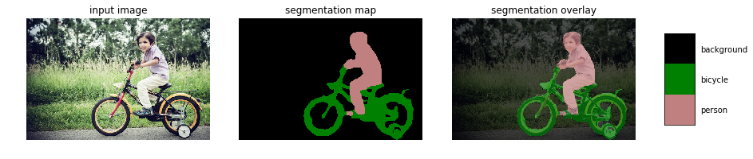
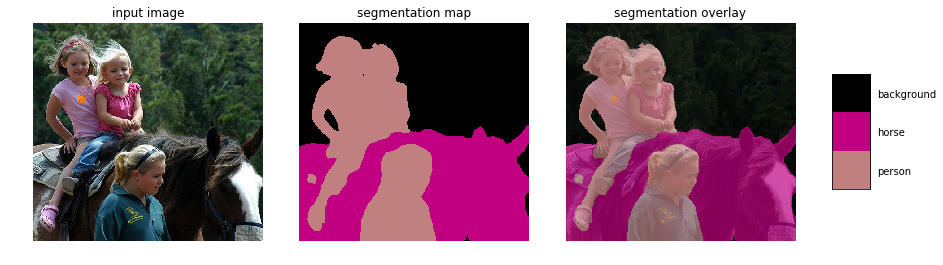
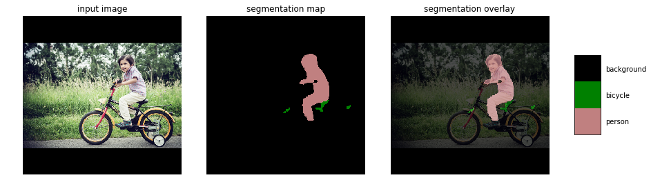
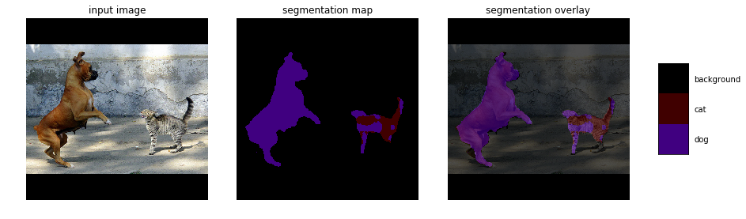
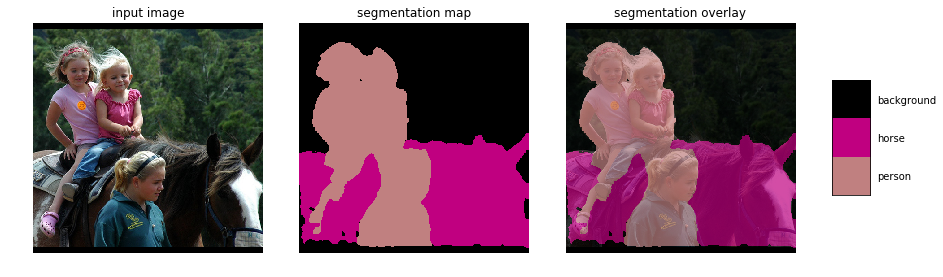
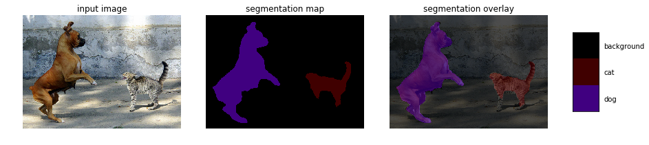

# Keras implementation of Deeplabv3+
DeepLab is a state-of-art deep learning model for semantic image segmentation.  

Model is based on the original TF frozen graph. It is possible to load pretrained weights into this model. Weights are directly imported from original TF checkpoint.  

Segmentation results of original TF model. __Output Stride = 8__
<p align="center">
    </br>
    </br>
    </br>
</p>

Segmentation results of this repo model with loaded weights and __OS = 8__  
Results are identical to the TF model  
<p align="center">
    </br>
    </br>
    </br>
</p>

Segmentation results of this repo model with loaded weights and __OS = 16__  
Results are still good
<p align="center">
    </br>
    </br>
    </br>
</p>

### How to get labels
Model will return tensor of shape `(batch_size, height, width, num_classes)`. To obtain labels, you need to apply argmax to logits at exit layer. Example of predicting on `image1.jpg`:  

```python
from matplotlib import pyplot as plt
import cv2 # used for resize. if you dont have it, use anything else
import numpy as np
from model import Deeplabv3
deeplab_model = Deeplabv3()
img = plt.imread("imgs/image1.jpg")
w, h, _ = img.shape
ratio = 512. / np.max([w,h])
resized = cv2.resize(img,(int(ratio*h),int(ratio*w)))
resized = resized / 127.5 - 1.
pad_x = int(512 - resized.shape[0])
resized2 = np.pad(resized,((0,pad_x),(0,0),(0,0)),mode='constant')
res = deeplab_model.predict(np.expand_dims(resized2,0))
labels = np.argmax(res.squeeze(),-1)
plt.imshow(labels[:-pad_x])
```

### How to use this model with custom input shape and custom number of classes
```python
from model import Deeplabv3
deeplab_model = Deeplabv3(input_shape=(384, 384, 3), classes=4)  
#or you can use None as shape
deeplab_model = Deeplabv3(input_shape=(None, None, 3), classes=4)
```
After that you will get a usual Keras model which you can train using `.fit` and `.fit_generator` methods.

### How to train this model

Useful parameters can be found in the [original repository](https://github.com/tensorflow/models/blob/master/research/deeplab/train.py).

Important notes:
1. This model doesn’t provide default weight decay, user needs to add it themselves.
2. Due to huge memory use with `OS=8`, Xception backbone should be trained with `OS=16` and only inferenced with `OS=8`.
3. User can freeze feature extractor for Xception backbone (first 356 layers) and only fine-tune decoder. Right now (March 2019), there is a problem with finetuning Keras models with BN. You can read more about it [here](https://github.com/keras-team/keras/pull/9965).

#### Known issues
This model can be retrained [check this notebook](https://github.com/Golbstein/Keras-segmentation-deeplab-v3.1/blob/master/segmentation.ipynb). Finetuning is tricky and difficult because of the confusion between `training` and `trainable` in Keras. See [this issue](https://github.com/bonlime/keras-deeplab-v3-plus/issues/56) for a discussion and possible alternatives. 


### How to load model
In order to load model after using model.save() use this code:

```python
from model import relu6
deeplab_model = load_model('example.h5',custom_objects={'relu6':relu6})
```

### Xception vs MobileNetv2
There are 2 available backbones. Xception backbone is more accurate, but has 25 times more parameters than MobileNetv2. 

For MobileNetv2 there are pretrained weights only for `alpha=1`. However, you can initiate model with different values of alpha.


### Requirement
The latest vesrion  of this repo uses TF Keras, so you only need TF 2.0+ installed  
tensorflow-gpu==2.0.0a0  
CUDA==9.0   

-------- 
If you want to use older version, use following commands:
```bash
git clone https://github.com/bonlime/keras-deeplab-v3-plus/
cd keras-deeplab-v3-plus/
git checkout 714a6b7d1a069a07547c5c08282f1a706db92e20
```
tensorflow-gpu==1.13  
Keras==2.2.4  
