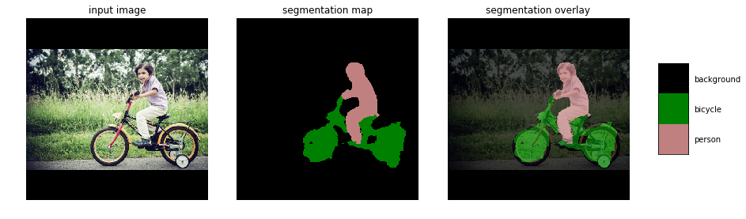
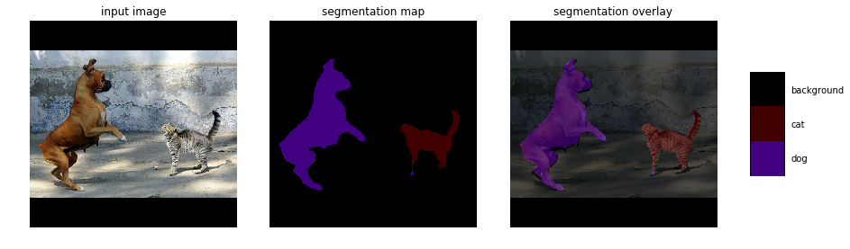

# keras-deeplab-v3-plus
Keras implementation of Deeplab v.3
Model is based on the original TF frozen graph. It is possible to load pretrained weights into this model. Weights are directly imported from original TF checkpoint  

Segmentation results of original TF model. __Output Stride = 8__

     
     
     

Segmentation results of this repo model with loaded weights:  
__This results were obtained with Output Stride = 16__  
Right now I cant make it work with OS = 8. Results qualiy is much worse than original 

     
     
     

